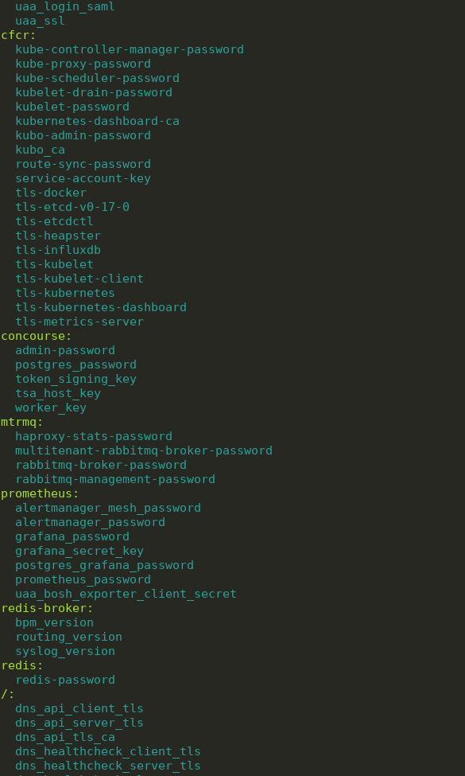

# Get CredHub Var

This is a small cmd line program that lets you very easily search and retrieve any secret stored on CredHub, including certificates.
Search results are sorted and categorized by the BOSH deployment the variable is in. If a single password is found then it will be copied to your clipboard automatically.

The image below shows the result of running `get-credhub-var ""`, which retrieves all the variables under all deployments.
The `/` section are variables that fall under no BOSH deployment.

Since BOSH secrets are structured like this: `/<BOSH-env-name>/<deployment-name>/<secret-name>`, to get all the variables in a deployment you can run with
`get-credhub-var /<deployment-name>/` (keeping the slashes). 

You can also run with `get-credhub-var my-search-term -v` to show the value of any secrets found. `-V` can be used if only one variable is found to print all the details about that secret.